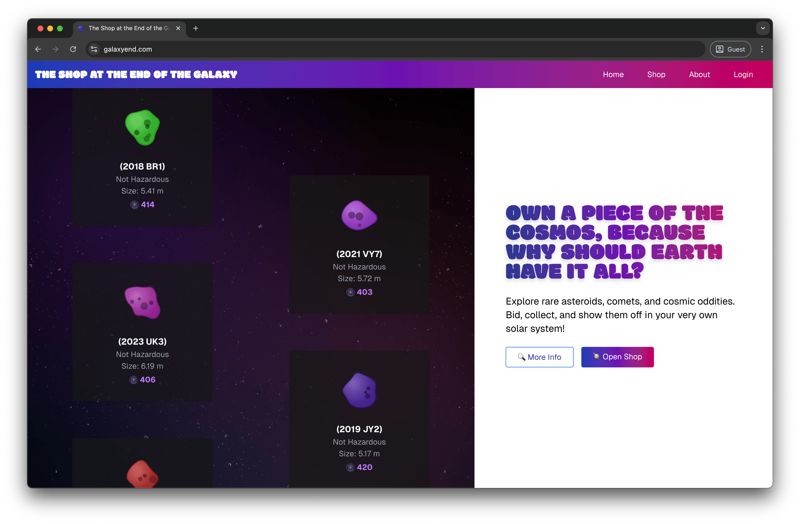

# The Shop at the End of the Galaxy



[galaxyend.com](https://galaxyend.com)

Full-stack marketplace where you can window-shop near-earth objects, powered by a Next.js frontend and a GraphQL API that wraps NASA's data services.

## Features

- Browse asteroids and cosmic curiosities with live pricing and availability.
- GraphQL API backed by MongoDB for caching and richer querying.
- Realtime WebSocket channel that shows how many people are eyeing the same asteroid.
- Authentication handled by Firebase for secure user sessions.

## Tech Stack

- **Frontend**: Next.js 15 (App Router), Tailwind CSS 4, Zustand, Apollo Client.
- **Backend**: Node.js, Express, Apollo Server, Mongoose, WebSocket (ws), Firebase (for authentication).
- **Database**: MongoDB 7.
- **Infrastructure**: Docker Compose (development & production).

## Repository Layout

- `frontend/` – Next.js app with UI, routing, and client state.
- `backend/` – Express + Apollo server, data loaders, cron jobs, and Firebase admin integration.
- `docker-compose.dev.yaml` – Dev-friendly stack (MongoDB + hot reloading services).
- `docker-compose.yaml` – Production stack.

## Getting Started

### TL;DR

Copy env files and run `docker compose up --build` from the repo root.

### Prerequisites

- Node.js 20+ and npm 10 (check with `node -v && npm -v`).
- Docker Desktop (or Engine) with Docker Compose, if you want the containerized workflow.
- MongoDB 7+ if you prefer running the database locally instead of Docker.
- Optional integrations:
  - NASA API key (https://api.nasa.gov/) to avoid demo rate limits.
  - Firebase Admin service account credentials.

### Environment Variables

Create local environment files from the checked-in examples and adjust the values as needed:

```bash
cp backend/.env.example backend/.env
cp frontend/.env.example frontend/.env.local
```

Key settings:

- `backend/.env`: MongoDB connection string, NASA API key, Firebase Admin credentials, session secret.
- `frontend/.env.local`: GraphQL endpoint, backend URL, Firebase client credentials.

> **Note:** The Firebase private key in `backend/.env` must stay quoted exactly as shown in the example so multi-line keys load correctly.

### Install Dependencies

Install packages for both application layers:

```bash
cd backend && npm install
cd ../frontend && npm install
```

Feel free to use `pnpm` or `yarn` if that matches your local tooling, just keep the lockfiles in sync.

## Local Development (with Docker Compose)

From the repository root run:

```bash
docker compose up --build
```

This starts MongoDB, the backend (with Nodemon), and the frontend (Next.js dev server) in watch mode. Containers mount your local source folders, so code edits immediately reflect inside the services. Use `docker compose down` to stop everything, and `docker compose logs -f <service>` for live logs. Use this file strictly for local development.

## Local Development (without Docker)

1. **Start MongoDB**
   - If you have MongoDB locally, ensure it is running (`mongod`).
   - Otherwise, spin up only the MongoDB container: `docker compose up mongo -d`.
2. **Run the backend**
   ```bash
   cd backend
   npm run dev
   ```
   The GraphQL API serves at `http://localhost:3001/graphql` and exposes a WebSocket at `ws://localhost:3001/ws/asteroid-viewers`.
3. **Run the frontend**
   ```bash
   cd frontend
   npm run dev
   ```
   Visit `http://localhost:3000` to browse the shop.

Changes in either project hot-reload automatically. Cron jobs and scheduled cache warmers will run as soon as the backend starts.

## Production Deployment (Docker)

```bash
docker compose -f docker-compose.yaml up --build
```

Pass `-d` to run the stack detached.

## Useful Commands

- `npm run format` / `npm run format:check` – Format source files (both backend and frontend).
- `npm run lint` (frontend) – Run ESLint against the Next.js app.
- `npm run test:cache` (backend) – Validate the cached asteroid data script.

## Troubleshooting

- **MongoDB connection errors**: confirm the `MONGO_URI`/`MONGODB_URI` in `backend/.env` matches either your local MongoDB or the Docker service (`mongodb://localhost:27017/galaxy-shop`).
- **NASA DEMO_KEY limits**: replace `NASA_API_KEY` with your personal key to avoid hitting the public rate limits while developing.
- **Firebase configuration**: both backend and frontend must agree on the Firebase project configuration when you enable authentication features.
